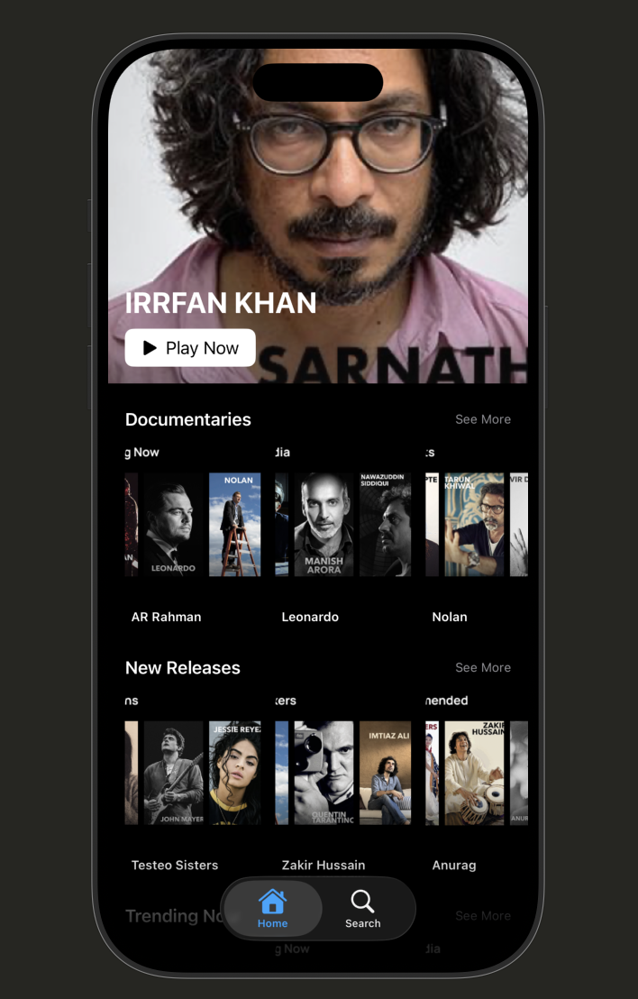
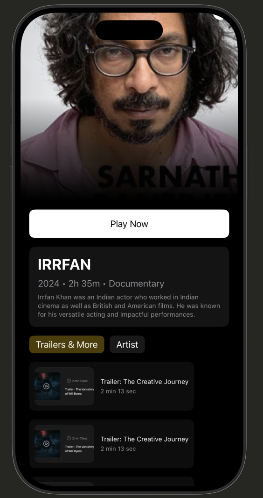

# 🎬 Movie App (SwiftUI)

## 📱 Overview

This project is an iOS application built using **SwiftUI** based on a provided Figma design.
The app demonstrates a modern movie browsing experience with multiple categorized sections and a detailed movie view.

The focus of this project is on **UI implementation, clean architecture (MVVM), and smooth navigation**, rather than backend integration.

---

## ✨ Features

* 🎨 Pixel-inspired UI based on Figma design
* 🧱 MVVM Architecture (Model-View-ViewModel)
* 🔁 Reusable UI Components (MovieCard, SectionRow)
* 📚 Multiple categorized sections:

  * Documentaries
  * New Releases
  * Trending Now
  * Recommended
  * Filmmakers
  * Musicians
  * Artists
  * Podcasts
  * From India / From Greece
* 🔍 Search bar UI (frontend)
* 🎬 Movie Detail Screen with:

  * Hero image
  * Play button
  * Description card
  * Trailer section
* 🔗 Navigation using `NavigationStack`
* 📱 Bottom Tab Bar
* 🌙 Dark Theme UI

---

## 🛠 Tech Stack

* **SwiftUI**
* **Combine**
* **Xcode**
* **MVVM Architecture**

---
## 📸 Screenshots

### 🏠 Home Screen




### 🎬 Movie Detail Screen




## 📂 Project Structure

```
MovieApp-SwiftUI/
│
├── Models/
│   └── Movie.swift
│
├── ViewModels/
│   └── MovieViewModel.swift
│
├── Views/
│   ├── Components/
│   │   ├── MovieCardView.swift
│   │   └── SectionRowView.swift
│   │
│   └── Screens/
│       ├── MovieListView.swift
│       └── MovieDetailView.swift
│
├── Assets.xcassets/
├── ContentView.swift
└── MovieApp.swift
```

---

## ▶️ How to Run the Project

1. Clone the repository:

   ```bash
   git clone https://github.com/Mohammedjunaid07/MovieApp-SwiftUI.git
   ```

2. Open the project in Xcode:

   ```
   Movie.web.xcodeproj
   ```

3. Select any iPhone simulator (e.g., iPhone 15)

4. Click **Run ▶️**

---


---

## ⚠️ Notes

* This project uses **dummy/static data** (no API integration)
* Images are reused across sections for demonstration purposes
* Focus is on **UI/UX and architecture**, not backend functionality

---

## 🎯 Learning Outcomes

* SwiftUI layout building
* MVVM architecture implementation
* Component-based UI design
* Navigation handling in SwiftUI
* Translating Figma design into code

---

## 👨‍💻 Author

**Mohammed Junaid**

* GitHub: https://github.com/Mohammedjunaid07
* LinkedIn: (Add your LinkedIn here)

---

## ⭐ Acknowledgment

This project was created as part of an iOS assignment to demonstrate SwiftUI development skills and UI implementation.
